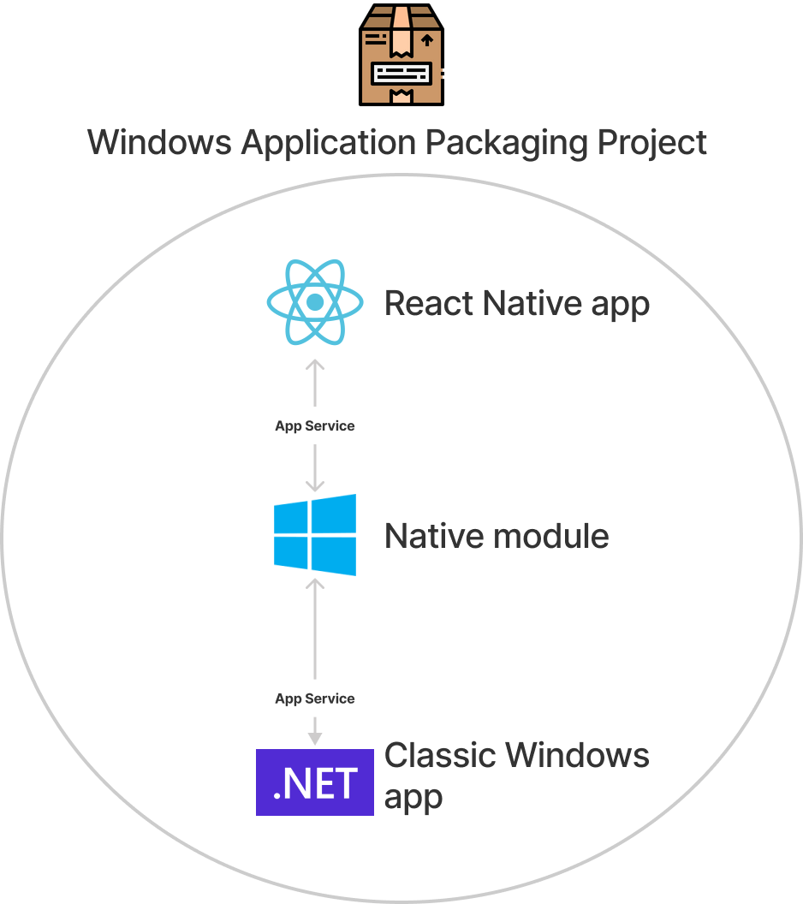
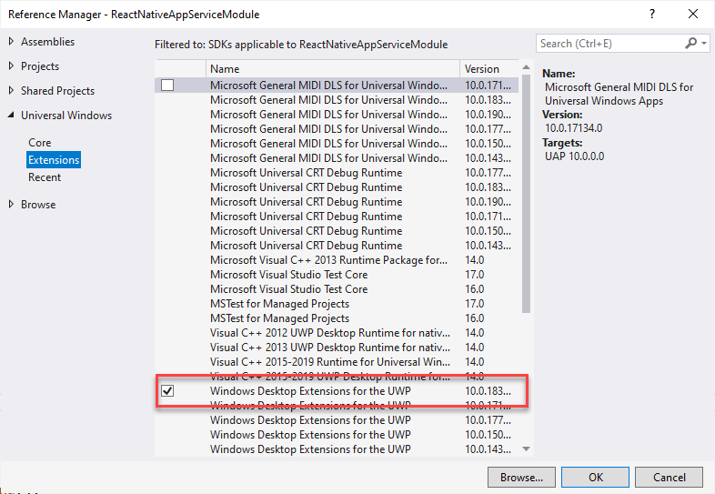
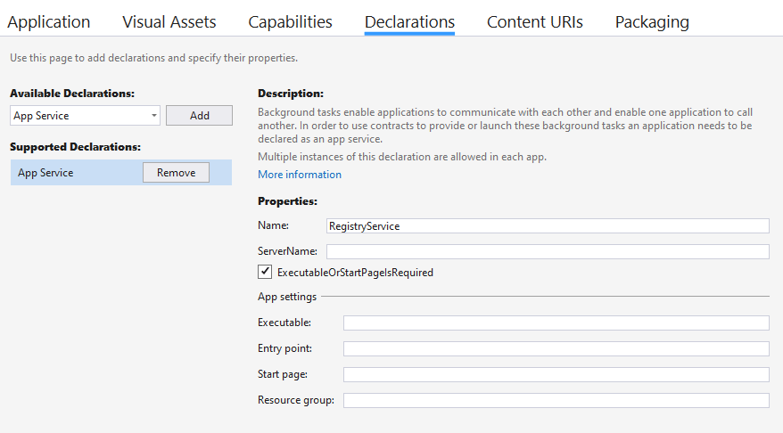
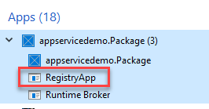
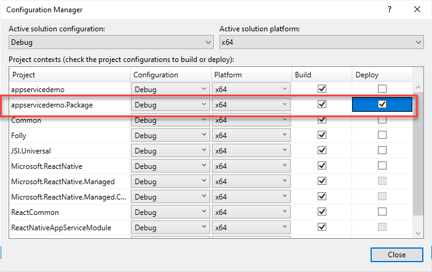

If you have adopted React Native to build your Windows applications, you'll know that the final output is a [Universal Windows Platform application](https://docs.microsoft.com/windows/uwp/get-started/universal-application-platform-guide). This development platform gives you access to all the latest enhancements in the Windows ecosystem (modern UI platform, notifications, integration with features like inking and Windows Hello, etc.), plus greater security and reliability thanks to the sandbox the application runs in.
However, there might be scenarios where UWP isn't enough and you need to perform one or more tasks which are supported only by the Win32 ecosystem: working with any file on the disk without user intervention, reading a key from the registry, integrating a SDK which doesn't support the Windows Runtime.

In this post we're going to explore a solution that will enable you to get the best of both worlds: a React Native for Windows application which integrates a classic Windows process. We're going to build a sample React Native application which will be able to read a registry key and display it. The goal is to display to the user values stored in the `\HKEY_LOCAL_MACHINE\SOFTWARE\Microsoft\Windows NT\CurrentVersion` hive, which contains many information about the currently installed version of Windows.

<!--truncate-->

The solution will use the following components.

#### A classic Windows process

We're going to build a .NET 5.0 console application which, by targeting Windows 10 and using the [Windows Compatibility Pack](https://docs.microsoft.com/dotnet/core/porting/windows-compat-pack), will be able to interact with the system registry. The React Native application will send to this process the name of the key we want to retrieve; the process will read its value and send it back to the React Native application.

#### A React Native for Windows application

This will be a traditional React Native for Windows application. However, as we're going to see later, we'll have to make a couple of changes to the host app generated by the template to handle the communication with the classic Windows process.

#### App Services

[App Services](https://docs.microsoft.com/windows/uwp/launch-resume/app-services) is a UWP feature that enables a Windows application to host one or more background tasks that can be consumed by other applications. You can think of this feature like REST services, but exposed locally. Once a UWP application which exposes an App Service is deployed on a machine, other applications can connect to it using its name and the Package Family Name of the hosting application. Once the communication channel is established, the calling application can send data to the App Service, which will process it and send back the results.

In our context, App Service will enable us to create a communication channel between the React Native application and the classic Windows process. The main difference compared to the traditional usage is that the App Service will be hosted and consumed by the same package, since the two processes (UWP and classic Win32) will be packaged together.

App Services support two approaches: [in-proc](https://docs.microsoft.com/windows/uwp/launch-resume/convert-app-service-in-process) (when the implementation of the service is defined in the main application itself) and [out-of-proc](https://docs.microsoft.com/windows/uwp/launch-resume/how-to-create-and-consume-an-app-service) (when the implementation of the service is defined in an external Windows Runtime Component, which gets executed in a different process). For our scenario, we must use the in-proc approach, since we need to hold a direct connection with the main application.

#### A native module

[A native module](https://microsoft.github.io/react-native-windows/docs/native-modules) is the way to expose native features to the JavaScript layer of React Native application. In the Windows context, a native module is a Windows Runtime Component that, through attributes which decorates your code, can expose methods, properties and events to JavaScript.
The native module is needed as a glue between the React Native world and the UWP world. All the APIs to interact with an App Service are exposed by the Windows Runtime and, as such, we need a middle man that can make them accessible to JavaScript.

#### Windows Application Packaging Project

A [Windows Application Packaging Project](https://docs.microsoft.com//windows/msix/desktop/desktop-to-uwp-packaging-dot-net) (WAP project, from now on) is a template available in Visual Studio, which is typically used to package as MSIX classic Windows application. In our context, we're going to use it to bundle together the classic Windows process and the React Native for Windows application in the same MSIX package.

The diagram below shows how all these components are tight together:



1. The user launches the React Native application which, at the same time, starts also the classic Windows process.
2. The Windows process, at startup, establishes a communication with the React Native application using an App Service and it stores a reference to the channel.
3. The user presses a button in the React Native application. 
4. The button will invoke a method method exposed by the native module. The method will push a message to the communication channel, so that it can be received by the classic Windows process. The message will contain the information about the key that the Windows process must retrieve from the registry.
5. The classic Windows process retrieves the desired key from the registry, it stores it inside another message and it sends it back to the communication channel. 
6. The native module, which is using the App Service to keep the communication channel open, receives the message with the retrieved key and it sends it back to the JavaScript layer.
7. The React Native application can now show to the user the value of the registry key.

Let's start building all the components!

> All the samples you'll find below (including the native module and the React Native host app) will be based on C#, since it's the language I'm most familiar with. However, the same goal can be achieved also using the C++ templates.

### The classic Windows process

For the purpose of this sample, we're going to use a .NET 5.0 console application. Open with Visual Studio the solution included in the `windows` folder of your React Native application, right click on it and choose **Add -> New project**. Choose **Console application** as template.

Before starting to write some code, we need to make a few changes:

1. Double click on the project and change the `TargetFramework` from `net5.0` to `net5.0-windows10.0.19041.0`. The new target will enable you to leverage Windows 10 APIs from your .NET application. It's required in our scenario since we need to use the App Service APIs.
2. Right click on the project, choose **Manage NuGet Packages** and install the [Microsoft.Windows.Compatibility](https://www.nuget.org/packages/Microsoft.Windows.Compatibility) package. It will give us access to the APIs to interact with the Windows registry.
3. Right click on the project, choose **Properties** and change the **Output type** from **Console Application** to **Windows Application**. Thanks to this change, our application will run headless, without any visible UI. This helps to achieve a good user experience, since our classic Windows process will run only in background. All the UI and interaction will be handled by the React Naive application.

The application will run continuously in background, until the main React Native application will be closed. To achieve this goal, we start the main process in a separate thread, which gets terminated when the connection with the App Service is closed (which means that the application is closed). This approach ensures that the classic Windows application doesn't become a "zombie" process, which stays alive even if the main app has been shut down.

```csharp
static AutoResetEvent appServiceExit;
static AppServiceConnection connection = null;

static void Main(string[] args)
{
    appServiceExit = new AutoResetEvent(false);
    Thread appServiceThread = new Thread(new ThreadStart(ThreadProc));
    appServiceThread.Start();
    appServiceExit.WaitOne();
}
```

The code above starts the execution of a method (called `ThreadProc`) in a separate thread. We use an `AutoResetEvent` to block the execution of the `Main()` method. This way, we make sure that the process will keep running until the communication channel created with the App Service is alive.

The `ThreadProc` method is the real "core" of the process, which takes care of initializing the connection with the App Service:

```csharp
static async void ThreadProc()
{
    connection = new AppServiceConnection();
    connection.AppServiceName = "RegistryService";
    connection.PackageFamilyName = Windows.ApplicationModel.Package.Current.Id.FamilyName;
    connection.RequestReceived += Connection_RequestReceived;
    connection.ServiceClosed += Connection_ServiceClosed;

    //we open the connection
    AppServiceConnectionStatus status = await connection.OpenAsync();

    if (status != AppServiceConnectionStatus.Success)
    {
        //if the connection fails, we terminate the Win32 process
        appServiceExit.Set();
    }
}
```

We create a new `AppServiceConnection` and we configure it in the following way:

- We specify the name of the App Service we want to connect to, using the `AppServiceName` property. This name must match the one we're going to include inside the manifest of the Windows Application Packaging Project in a later stage.
- We specify the Package Family Name of the application which hosts the App Service. In our scenario, since the React Native application and the classic Windows process are hosted in the same package, we can retrieve it using the `Windows.ApplicationModel.Package` APIs.
- We subscribe to two events: `RequestReceived`, which is triggered when the React Native application sends a message; `ServiceClosed`, which is triggered when the App Service channel is shut down.

Then we use the `OpenAsync()` method to open the connection. If it isn't successful, there's no need for this process to stay alive, so we call `Set()` on the `AutoResetEvent` object, so that the `Main()` method can terminate.

Let's see now the implementation of the two event handlers. The first one, `ServiceClosed`, is the easiest one:

```csharp
private static void Connection_ServiceClosed(AppServiceConnection sender, AppServiceClosedEventArgs args)
{
    //when the connection with the App Service is closed, we terminate the Win32 process
    appServiceExit.Set();
}
```

If the communication with the App Service drops, we simply call `Set()` on the `AutoResetEvent` object so that the process can terminate.

The second one, `RequestReceived`, instead, is the one where the communication with the React Native application happens:

```csharp
private static async void Connection_RequestReceived(AppServiceConnection sender, AppServiceRequestReceivedEventArgs args)
{
    string key = args.Request.Message["RegistryKeyName"].ToString();

    var hive = Registry.LocalMachine.OpenSubKey(@"SOFTWARE\Microsoft\Windows NT\CurrentVersion", false);
    string value = hive.GetValue(key).ToString();

    ValueSet valueSet = new ValueSet
    {
        { "RegistryKeyValue", value }
    };

    await args.Request.SendResponseAsync(valueSet);
}
```

From the `Request.Message` dictionary of the event arguments, we can retrieve any information passed by the main React Native application. In our scenario, the name of the requested registry key will be stored in an item with `RegistryKeyName` as key.
We use this information to connect to the registry (using the `Registry` APIs) and to retrieve this key from `SOFTWARE\Microsoft\Windows NT\CurrentVersion`, which is the hive that contains all the information about the currently installed version of Windows.

Once we have retrieved the key, we stored it a new message (the `ValueSet` object) with key `RegistryKeyValue`. In the end, we send it back using the `SendResponseAsync()` method, so that the caller (in our case, the native module) can use it.

### The React Native for Windows application

When the classic Windows application invokes the `OpenAsync()` method to connect to the App Service, the host UWP app will wake up to respond (remember that we're using an in-proc App Service). This scenario is handled by a special event called `OnBackgroundActivated`, which you can subscribe in the `App` class of the host app. This is the implementation:

```csharp
protected override void OnBackgroundActivated(BackgroundActivatedEventArgs args)
{
    base.OnBackgroundActivated(args);

    if (args.TaskInstance.TriggerDetails is AppServiceTriggerDetails details)
    {
        appServiceDeferral = args.TaskInstance.GetDeferral();

        var ns = ReactPropertyBagHelper.GetNamespace("RegistryChannel");
        var name = ReactPropertyBagHelper.GetName(ns, "AppServiceConnection");

        InstanceSettings.Properties.Set(name, details.AppServiceConnection);
    }
}
```

First, we check if the type of activation is `AppServiceTriggerDetails`, since the application might have other background activation entry points. If that's the case we retrieve a deferral and we store it as a class variable:

```csharp
sealed partial class App : ReactApplication
{
    private BackgroundTaskDeferral appServiceDeferral;

    public App() 
    {
        // ...
    }
    
    // ...
}
```

The deferral is [a concept used by the Universal Windows Platform](https://blogs.windows.com/windowsdeveloper/2016/04/28/the-lifecycle-of-a-uwp-app/) to properly handle asynchronous methods in background tasks. Since, when an asynchronous method is started, its execution is delegated to another thread, the background task might think that the operation is completed so Windows will terminate it. To avoid this scenario, we use a deferral to manually tell to the background task when the operation is really completed, by calling the `Complete()` method at the end. However, in our scenario, we just need to call `GetDeferral()` to get one, but we don't actually need to complete it, since we want our channel to stay alive until the application is running. If we don't do this, the channel would open, but it would be closed after a few seconds.

The last past of the code introduces a new concept, which are **React Property Bags**. This is a feature included in React Native which enables to share key / value pairs across an entire React Native application, including its modules. Why do we need it? Since we're building a React Native app, the UWP application won't contain the actual code which interacts with the App Service, but it will just host the JavaScript layer. As such, the communication will be handled by the native module. Thanks to React Property Bags, we can store a reference to the App Service in the host but let the native module use it.

The code creates a new property bag, which is composed by a namespace (`RegistryChannel`) and a name (`AppServiceConnection`). Then, using the `InstanceSettings` static class, we create the property bag in the current instance, by calling the `Set()` method and passing, as object to store, the App Service channel we have just created.

### The native module

Now we are ready to interact with the classic Windows process we have previously built. In a regular UWP scenario, we would have interacted with the App Service directly in the main application. However, in React Native for Windows, the UWP app is just a host for the JavaScript layer, so we need to build a native module to expose the APIs we need to JavaScript.

The next step is to add a native module to your solution. This is well documented in the [official documentation](https://microsoft.github.io/react-native-windows/docs/native-modules-setup). The module I'm going to build is a C# Windows Runtime Component, but of course you can do the same in C++.

By default, the module will contain two classes: one called `ReactPackageProvider`, which handles the registration in the main app, and one called `ReactNativeModule`, which contains the module definition. The default implementation of the class provided by the template will look like this:

```csharp
namespace ReactNativeAppServiceModule
{
[ReactModule("ReactNativeAppServiceModule")]
internal sealed class ReactNativeModule
{

    private ReactContext _reactContext;

    [ReactInitializer]
    public void Initialize(ReactContext reactContext)
    {
        _reactContext = reactContext;
    }

    [ReactMethod]
    public void sampleMethod(string stringArgument, int numberArgument, Action<string> callback)
    {
        // TODO: Implement some actually useful functionality
        callback("Received numberArgument: " + numberArgument + " stringArgument: " + stringArgument);
    }
}
}
```

The class already includes many elements we're going to need, like the `[ReactModule]` attribute to expose the module to JavaScript; the `[ReactMethod]` attribute to expose a method to JavaScript; the `[ReactInitializer]` attribute, which decorates the method that give us access to the `ReactContext` property. This is the object that will contain the property bag we have set in the main application.

Keep everything as it is, but delete the `sampleMethod()` function. We're going to replace it with the real methods that we need to expose to JavaScript.

Let's start with the first one:

```csharp
[ReactMethod("launchFullTrustProcess")]
public async Task LaunchFullTrustProcessAsync()
{
    await FullTrustProcessLauncher.LaunchFullTrustProcessForCurrentAppAsync();
}
```

This method uses the `FullTrustProcessLauncher` API to launch a classic Windows process from a UWP application. We just need to call it as it is. We're going to specify the information about the process to launch later in the manifest. Later, we're going to call this method from the JavaScript layer when the application starts.
By default, the `FullTrustProcessLauncher` class won't be found. The reason is that this API isn't included in UWP by default, but it's part of the specific extensions for desktop. As such, you have to right click on the native module's project, choose **Add reference** and, in the **Universal Windows -> Extensions** section, click on the latest version of the `Windows Desktop Extension for UWP`.



Let's see now the second method:

```csharp
[ReactMethod("getRegistryKey")]
public async Task<string> GetRegistryKey(string key)
{
    var ns = ReactPropertyBagHelper.GetNamespace("RegistryChannel");
    var name = ReactPropertyBagHelper.GetName(ns, "AppServiceConnection");

    var content = _reactContext.Handle.Properties.Get(name);

    var _connection = content as AppServiceConnection;

    ValueSet valueSet = new ValueSet
    {
        { "RegistryKeyName", key }
    };

    var result = await _connection.SendMessageAsync(valueSet);

    string message = result.Message["RegistryKeyValue"].ToString();
    return message;
}
```

This is the method that we'll invoke from the React Native application when we want to retrieve the value of a registry key. Through the `ReactContext` object we have retrieved in the initialization of the module, we can use the `Properties` collection to access to the property bags. We look for one called `AppServiceConnection` in the `RegistryChannel` namespace, which contains the reference to our App Service channel.
Once we have the channel, we can use it to send a message with the name of the key we want to retrieve (encapsulated in a `ValueSet` object) to the classic Windows process using the `SendMessageAsync()` method. The message will be received by the Windows process, which will retrieve the value of the requested key from the registry, and then it will send it back to our native module, as result of the `SendMessageAsync()` method. The response will be included in the `Message` collection with key `RegistryKeyValue`: we simply return this value to the JavaScript layer, so that the React Native app can display it.

There's one last step to do. Since we have manually created this module, we have also to manually register it in the main host application. As first step, right click on the host app, choose **Add reference** and select the native module. Then move to the `App` class and, in the constructor, add the following line before the `InitializeComponent()` method is invoked:

```csharp
PackageProviders.Add(new ReactNativeAppServiceModule.ReactPackageProvider());
```

In case you have created the native module with a different name, make sure to replace `ReactNativeAppServiceModule` with the correct namespace.

### The Windows Application Packaging Project

The last step before we can try our solution is to add a Windows Application Packaging Project, which will help us to put together inside the same package the host UWP app and the classic Windows process. Right click on the solution, choose **Add -> New project** and look for the template called **Windows Application Packaging Project**. Once you have added it, right click on it and choose **Add reference**. Now you have to select two projects from your solution: the React Native host UWP app and the classic Windows process. Once it's done, expand the **Applications** node, right click on the name of the host UWP app and choose **Set as entry point**. This will ensure that, when you click on the app icon in the Start menu, the main React Native app will be the one being launched.

Now we have to make a few changes to the manifest. One of the important differences you have to be aware when you introduce the Windows Application Packaging Project in a scenario like ours is that its manifest becomes the main one. As such, if you have previously customized the manifest of your host UWP app (for example, by adding assets for the icons, changing the identity or adding a few capabilities), you will have to port them in the manifest of the WAP project.
For this exact reason, make sure to make the following changes in the `Package.appxmanifest` file of the WAP project and not in the one of the host UWP app.

The first change is declaring the App Service. If you remember, previously in code we had to specify two information to connect to the App Service from the Windows classic process: the name and the Package Family Name. The name is defined exactly in the manifest. Double click on the **Package.appxmanifest** file, move to the **Declarations** tab and, from the dropdown, choose **App Service** and click **Add**. The only required field is **Name**, which we have to fill with the same name that we have previously specified in code, which is `RegistryService`. Since it's an in-proc App Service, we don't have to specify any other information.



The second change is declaring which is the classic Windows process that we want to launch when we use the `FullTrustLauncher` API. This feature isn't supported by the Visual Studio UI, so you'll have to right click on the `Package.appxmanifest` file and choose **View code**. You will find a section called `Extensions`, where the App Service has been declared. Exactly below, add the following entry:

```xml
<Extensions>
  <uap:Extension Category="windows.appService">
    <uap:AppService Name="RegistryService"/>
  </uap:Extension>
  <desktop:Extension Category="windows.fullTrustProcess" Executable="RegistryApp\RegistryApp.exe" />
</Extensions>
```

The `Executable` attribute specifies the path of the classic Windows process inside the package. By default, the WAP project puts all the build outputs inside a folder with the same name of the project. As such, our classic Windows app will be available at the path `RegistryApp\RegistryApp.exe`. 
To make this extension working, you will have also to declare the `desktop` namespace at the top, since it isn't included by default:

```xml
<Package
  xmlns="http://schemas.microsoft.com/appx/manifest/foundation/windows10"
  xmlns:uap="http://schemas.microsoft.com/appx/manifest/uap/windows10"
  xmlns:desktop="http://schemas.microsoft.com/appx/manifest/desktop/windows10"
  IgnorableNamespaces="uap desktop">
```

The final change we would need to make is to add a capability called **runFullTrust**, which enables our package to include a classic Windows component and not just a UWP application. However, the default manifest included in the WAP project already defines that. You can see it in the `Capabilities` section of the manifest:

```xml
<Capabilities>
  <Capability Name="internetClient" />
  <rescap:Capability Name="runFullTrust" />
</Capabilities>
```

### The React Native application

Finally, we now have all the pieces of the puzzle and we can start working on the JavaScript layer. As first step, we need to launch the classic Windows process when the React Native application starts. If you're using a functional component, you can use the `useEffect` hook; if you're using a class component, you can use the `componentDidMount` event. In my case, I'm going for the first option, so I added in my application the following function:

```javascript
useEffect(() => {
  async function launchProcess() {
    await NativeModules.ReactNativeAppServiceModule.launchFullTrustProcess();
  }
  launchProcess();
}, []);
```

If you have used native modules before, the code should be easy to understand. We use the `NativeModules` API in React to access to our native module, by specifying its name (`ReactNativeAppServiceModule`, which we have set using the `[ReactModule]` attribute) and the method (`launchFullTrustProcess()`, which we have set using the `[ReactMethod]` attribute).

The outcome is that, when you launch the main app from the Start menu, also the classic Windows process will be launched. However, since it doesn't have any UI, it will run in background. You'll be able to see it using Task Manager: 



Now we need to store two information in the component's state: the name of the registry key we want to get (which will be filled by the user using a `TextInput` control) and its value, which will be returned by our native module. Since I'm using a functional component, I'm going to use the `useState` hook:

```javascript
const[registryKeyName, setRegistryKeyName] = useState('');
const[registryKeyValue, setRegistryKeyValue] = useState('');
```

Now let's define the function that will invoke the native module to get the registry key and will store the result in the state:

```javascript
const getRegistryKey = async() => {
  var result = await NativeModules.ReactNativeAppServiceModule.getRegistryKey(registryKeyName);
  setRegistryKeyValue(result);
}
```

The approach is the same as the previous one: the only difference is that, this time, we're invoking the `getRegistryKey()` function, which requires as parameter the name of the key we want to retrieve from the `HKEY_LOCAL_MACHINE\SOFTWARE\Microsoft\Windows NT\CurrentVersion` hive.

Now let's build a minimal UI: a `TextInput` control, which will read the name of the registry key and store it in the state; a `Button`, which will invoke the `getRegistryKey()` function; a `Text`, which will display the value returned by the function.

```jsx
<View>
  <TextInput onChangeText={text => setRegistryKeyName(text)} />
  <Button title="Get registry key" onPress={getRegistryKey} />
  <Text>{registryKeyValue}</Text>
</View>
```

### Running the app

We're ready to test our work! First, go to Visual Studio, right click on the Windows Application Packaging Project and choose Deploy. You might get the following error:

```plaintext
Error Task 'AddProjectMetadata' failed. The expression "[MSBuild]::MakeRelative(C:\ReactCSharp, *Undefined*)" cannot be evaluated. Illegal characters in path. C:\ReactCSharp\node_modules\react-native-windows\PropertySheets\Autolink.props
ReactCSharp.Package C:\Program Files (x86)\Microsoft Visual Studio\2019\Enterprise\MSBuild\Microsoft\DesktopBridge\Microsoft.DesktopBridge.targets 408 
Error MSB4184 The expression "[MSBuild]::MakeRelative(C:\ReactCSharp, *Undefined*)" cannot be evaluated. Illegal characters in path. C:\ReactCSharp\node_modules\react-native-windows\PropertySheets\Autolink.props ReactCSharp.Package C:\ReactCSharp\node_modules\react-native-windows\PropertySheets\Autolink.props 12
```

If that's a case, this is a known issue that has already been addressed, but the fix isn't available yet in the latest stable React Native for Windows version. However, the workaround is easy. Open the file in the path `node_modules\react-native-windows\PropertySheets\Autolink.props` and replace the following line:

```xml
<AutolinkCommandArgs Condition="'$(AutolinkCommandArgs)' == '' And '$(SolutionPath)' != '' And '$(ProjectPath)' != ''">--check --sln $([MSBuild]::MakeRelative($(AutolinkCommandWorkingDir), $(SolutionPath))) --proj $([MSBuild]::MakeRelative($(AutolinkCommandWorkingDir), $(ProjectPath)))</AutolinkCommandArgs>
```

with

```xml
<AutolinkCommandArgs Condition="'$(AutolinkCommandArgs)' == '' And '$(SolutionPath)' != '' And '$(SolutionPath)' != '*Undefined*' And '$(ProjectPath)' != ''">--check --sln $([MSBuild]::MakeRelative($(AutolinkCommandWorkingDir), $(SolutionPath))) --proj $([MSBuild]::MakeRelative($(AutolinkCommandWorkingDir), $(ProjectPath)))</AutolinkCommandArgs>
```

If you're building the project for the first time, it will take a while. Once it's deployed, you will find two entries in the Start menu: one for the base host app (for example, `appservicedemo`) and one for the WAP project (for example, `appservicedemo.Package`). Don't worry, when you will generate a MSIX package for release this won't happen anymore. However, if you want to remove this confusion also while you're debugging, just go back to Visual Studio, choose **Build -> Configuration Manager** and make sure that the **Deploy** flag is turned on only for the WAP project.



Before clicking on the Start menu entry for the WAP project, make sure to open a terminal on the folder which contains your project and run `yarn start` to launch the Metro packager.
If everything went well, the UI of the app should show up. Specify in the text box the name of one of the keys in the `HKEY_LOCAL_MACHINE\SOFTWARE\Microsoft\Windows NT\CurrentVersion` registry hive (for example, `BuildLab`) and press the button. If you did everything correctly, the value of the key will be displayed:


If you want to create a package for release (to publish on the Microsoft Store or sideload on another machines), make sure to start the wizard (**Publish --> Create App Packages**) from the WAP project and not from the host app, otherwise the classic Windows process won't be included.

### Conclusion

It was a long journey, but now we have a React Native for Windows application which can interact with the Win32 ecosystem. In this article we built a sample scenario based on registry access, but the opportunities are unlimited! You can integrate SDKs which aren't supported by the Universal Windows Platform; or enhance your React Native application with features that otherwise won't be supported. You can find the sample project built for this article [on GitHub](../../samples/AppServiceDemo).

### Credits

Icons used in the architecture:

- [React Flat Icon](https://iconscout.com/icons/react) by [Icon Mafia](https://iconscout.com/contributors/icon-mafia)
- [Windows Flat Logo Icon](https://iconscout.com/icons/windows) [Icon Mafia](https://iconscout.com/contributors/icon-mafia)
- [Package Colored Outline Icon](https://iconscout.com/icons/package) by [Vichanon Chaimsuk](https://iconscout.com/contributors/ferdizzimo)
