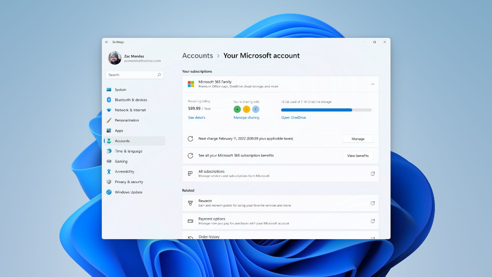

In this post we discuss how and why Microsoft is using React Native for Windows to deliver the Your Microsoft Account page in Windows 11 Settings.

<!--truncate-->

Windows 11 [Insider Preview Build 22489](https://blogs.windows.com/windows-insider/2021/10/27/announcing-windows-11-insider-preview-build-22489/) debuted the **Your Microsoft account** Settings page, a re-imagined entry point in Settings that displays information related to your Microsoft account, including your subscriptions for Microsoft 365, links to order history, payment details, and Microsoft Rewards. 

This page introduces a new mechanism that enables Windows to improve the **Your Microsoft account** page over time via [Online Service Experience Packs](https://blogs.windows.com/windows-insider/2021/10/27/announcing-windows-11-insider-preview-build-22489/); these are a way to make updates to Windows outside of major OS updates. This underlying infrastructure will enable other Windows 11 experiences to leverage the Online Service Experience Pack capability over time.

React Native for Windows is a key technology that powers Online Service Experience Packs to deliver the **Your Microsoft Account** page in Settings. Let’s dive into how and why Microsoft is using React Native for Windows to help the team be more productive and integrate seamlessly with the look and feel of the Windows 11 OS.

## Introduction to the “Your Microsoft Account” page
Enabling you to manage your account information directly from the Windows 11 Settings is one of the key goals for the new **Your Microsoft Account** page. Before Windows 11, your only option for managing these settings was to visit the [accounts.microsoft.com](https://accounts.microsoft.com) website (“AMC”). The team wanted to have a consistent set of functionality and user experience between the native and web versions and considered several options to accomplish this, including: 
1.  Maintain separate codebases (both the web front-end and a WinUI/native based front-end)
1.  Host the AMC web content in a WebView control inside the Settings app
1.  Use [React Native for Windows](https://microsoft.github.io/react-native-windows/) to share some code and have it render natively

The first option requires different codebases and is difficult to keep a consistent set of features between the two, especially as services iterate faster than the cadence at which Windows ships. Additionally, the team would need expertise in both web technology and native WinUI technology.  

Using a WebView reduces the upkeep cost; however, it suffers from a few problems. The visual appearance of controls would not fit in with the rest of the Windows 11 Settings app. Secondly, performance and accessibility of WebView UX tend not to be as good as a native equivalent. Lastly, interfacing between code running inside the WebView and the platform is cumbersome and limited.

This led us to the third option, which is using React Native for Windows in the Settings app. With React Native for Windows, you can use JavaScript to drive app logic, while sharing code across experiences.

React Native for Windows enables teams to be more productive by allowing them to quickly iterate on a change, without having to spend time rebuilding. Because it uses WinUI for rendering UI, it integrates seamlessly with the look and feel of the OS, with great performance, accessibility, and a rich set of features.

## React Native for Windows + “Your Microsoft Account” page
One of the goals for the Your Microsoft Account page was to share business logic between the web and native platforms. React Native for Windows enables sharing core business logic while also enabling visual consistency between the web and native without needing to duplicate code. More importantly, the visual fidelity of the native experience is “authentically native” because _the page itself is native_, resulting in beautiful animations, accessibility, and the latest Windows 11 styles.

Beyond the benefit to user experience, our team also experienced a set of developer productivity benefits as well. Developing with React Native increased our “dev inner loop” by providing features like fast refresh, which meant that changes to the JavaScript code could be seen instantly – with no app rebuild required. Additionally, through a custom hook implementation within the Windows Update service, we can safely and securely deliver JavaScript bundles to end users more quickly, whether it is a new feature or a fix for a critical issue.

The “Your Microsoft Account” page leverages the **React Native WinRT** extension to access the underlying native WinRT platform directly from JavaScript. To learn how you can take advantage of **React Native WinRT**, check out the companion blog post [“Calling Windows APIs from React Native just got easier”](https://aka.ms/rnwinrtblog).

If you would like to enable service delivery within your React Native application, check out [App Center CodePush for React Native](https://github.com/Microsoft/react-native-code-push), which is a solution for building, testing, distributing, and monitoring React Native apps. 

## Conclusion 

React Native for Windows allows the Windows team to deliver new features to users faster and share business logic across web/native – all while taking advantage of the native platform’s visual fidelity, performance, and accessibility. 

Whether you have a React Native mobile app or are interested in building a Windows-first app, you can use React Native for Windows to bring your app to Windows with the same quality as built-in Windows components like the **Your Microsoft Account** page. 

If you’re interested in getting started with React Native for Windows, check out our website at [aka.ms/reactnative](https://aka.ms/reactnative). 

You can also follow us on Twitter [@ReactNativeMSFT](https://twitter.com/reactnativemsft) to keep up to date on news, feature roadmaps, and more. 
